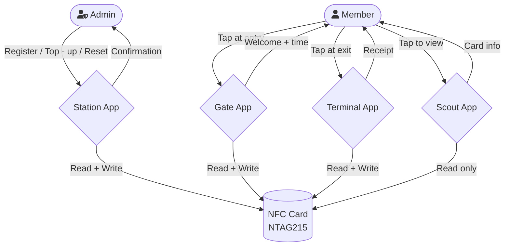
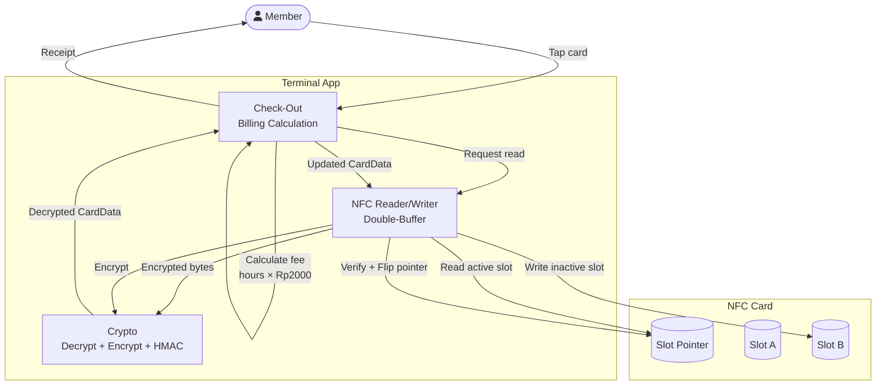
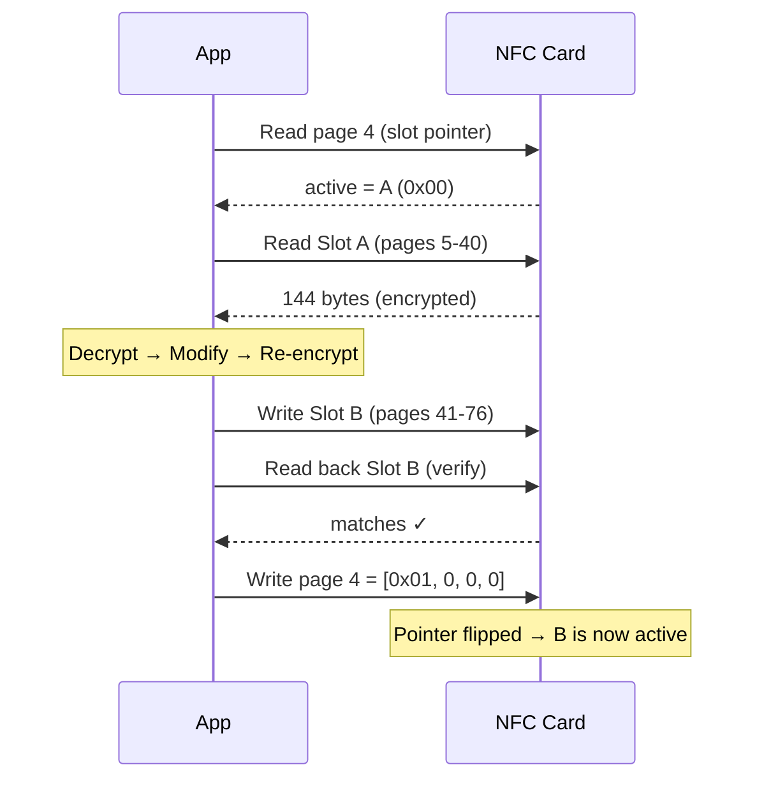
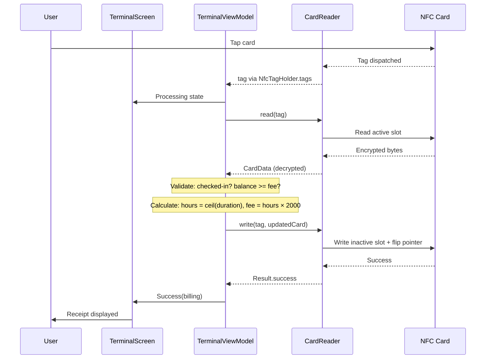
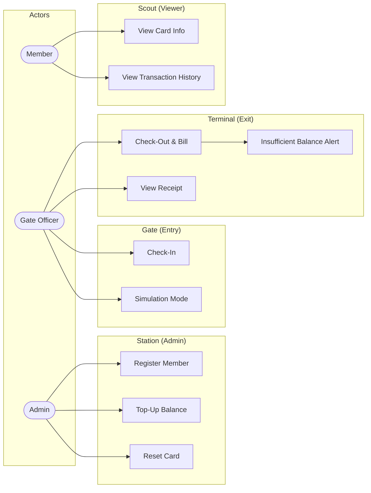

# Parkeer — NFC Koperasi Membership Card

An offline-first Android NFC application for village cooperatives (koperasi) in rural Indonesia. It
turns NTAG215 NFC cards into portable digital membership cards that store identity, balance, visit
status, and transaction history — all without requiring any server or internet connection.

**The card IS the database.** All data lives on the physical NFC card itself.

---

## About

Parkeer solves the problem of digital administration in areas with unreliable internet. A single APK
serves 4 operational roles:

| Mode         | Role         | Function                                      |
|--------------|--------------|-----------------------------------------------|
| **Station**  | Admin        | Register members, top-up balance, reset cards |
| **Gate**     | Gate Officer | Check-in (record entry timestamp)             |
| **Terminal** | Gate Officer | Check-out (calculate fee, deduct balance)     |
| **Scout**    | Member       | Read-only card viewer                         |

### Key Business Rules

- Parking rate: Rp 2,000/hour (ceiling-rounded)
- Max balance: Rp 1,000,000
- Transaction history: last 5 entries (FIFO)
- Sequential integrity: must check-in before check-out
- 100% offline operation

---

## Requirements

| Requirement    | Version                                |
|----------------|----------------------------------------|
| JDK            | 17                                     |
| Android Studio | Ladybug or newer                       |
| NDK            | 27.x (CMake 3.22+)                     |
| Android SDK    | compileSdk 36, minSdk 26, targetSdk 35 |
| Device         | NFC-capable Android phone              |
| NFC Cards      | NTAG215 (504 bytes user memory)        |

### Environment Variables

```bash
JFROG_USERNAME=<telkomsel-jfrog-username>
JFROG_PASSWORD=<telkomsel-jfrog-password>
```

### Firebase

Place `google-services.json` in `app/`.

---

## How to Build & Run

```bash
# Clone
git clone <repo-url>
cd NFC-Koperasi/Apps

# Build debug APK
./gradlew :app:assembleDebug

# Install on device
./gradlew :app:installDebug

# Run tests
./gradlew test

# Lint & format
./gradlew spotlessApply
```

> **Note:** The device must have NFC enabled. NTAG215 cards are required for full functionality.

---

## Architecture

**MVVM + Clean Architecture (multi-module)**

```
:app
├── :feature:station  → :core:model, :core:nfc, :core:ui
├── :feature:gate     → :core:model, :core:nfc, :core:ui
├── :feature:terminal → :core:model, :core:nfc, :core:ui
├── :feature:scout    → :core:model, :core:nfc, :core:ui
├── :core:model       (pure Kotlin data classes)
├── :core:nfc         → :core:cardprotocol, :core:crypto
├── :core:crypto      (AES-GCM, HMAC, NDK native key)
├── :core:cardprotocol → :core:model, :core:crypto
├── :core:ui          (shared Compose components)
└── :core:firebase    (analytics, crashlytics, perf)
```

### Design Principles

- Feature modules never depend on each other
- Card is single source of truth (no local database)
- Double-buffer NFC writes for crash safety
- Per-card key derivation (UID-bound) for clone resistance
- Monotonic write counter prevents nonce reuse

---

## Tech Stack

| Layer         | Technology                                          |
|---------------|-----------------------------------------------------|
| Language      | Kotlin 2.3                                          |
| UI            | Jetpack Compose (BOM 2025.01.01) + Material 3       |
| Design System | Telkomsel Dexterity 1.0.0                           |
| DI            | Hilt 2.54                                           |
| Async         | Coroutines 1.10.1 + Flow                            |
| NFC           | Android NFC API (MifareUltralight)                  |
| Crypto        | AES-256-GCM, HMAC-SHA256, HKDF (javax.crypto + NDK) |
| Navigation    | Compose Navigation 2.8.5                            |
| Animation     | Lottie (dotlottie-android 0.5.0)                    |
| Firebase      | Analytics, Crashlytics, Performance                 |
| Build         | Gradle KTS, Version Catalogs                        |
| Quality       | Spotless + ktlint, Compose Lint, Stability Analyzer |
| Testing       | JUnit 5, MockK, Turbine                             |

---

## Data Flow Diagram

### Level 0 — Context



### Level 1 — Terminal (Check-Out)



---

## Sequence Diagram

### NFC Double-Buffer Write



### Check-Out Flow



---

## Use Case Diagram



---

## Security

### Cryptographic Layers

| Layer          | Primitive                         | Purpose                                              |
|----------------|-----------------------------------|------------------------------------------------------|
| Key Derivation | HKDF-SHA256                       | masterKey + cardUID → per-card 256-bit key           |
| Encryption     | AES-256-GCM                       | Encrypt identity + balance (20B → 36B with auth tag) |
| Integrity      | HMAC-SHA256 (8B)                  | Tamper detection on non-encrypted fields             |
| IV             | cardUID (7B) + counter (4B) + pad | Unique per write, prevents nonce reuse               |

### Card Memory Layout (NTAG215, 144B per slot)

```
[0..1]   Magic 0x4C44
[2]      Version 0x01
[3]      Flags (registered + active)
[4..7]   Write counter (monotonic)
[8..43]  AES-GCM encrypted block (ID + name + balance)
[44..55] Visit state + check-in timestamp
[56..135] Transaction logs (5 × 16B)
[136..143] HMAC-SHA256 (truncated 8B)
```

### Anti-Tamper Measures

- UID-bound encryption (clone → different key → decryption fails)
- Monotonic write counter (replay → stale nonce → decryption fails)
- NDK native master key with anti-debug (ptrace, Frida detection)
- Play Integrity API for device attestation
- ProGuard/R8 obfuscation in release builds

---

## License

Internal assessment project — Telkomsel.
